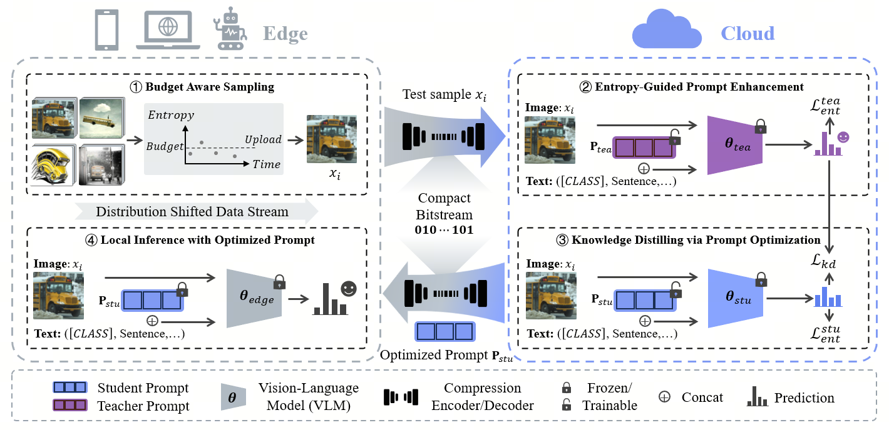
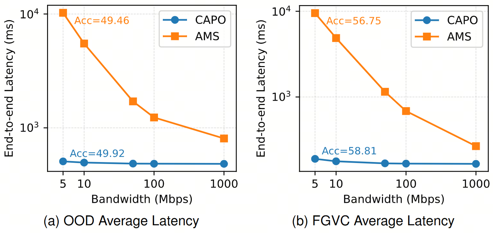

# CAPO

**Cloud-Edge Collaborative Adaptation for Vision-Language Model via Compact Prompt Optimization**

Accepted by IEEE Transactions on Multimedia

## Abstract

While vision-language foundation models have significantly improved performance and broadened application prospects, deploying these models on edge devices is impractical due to computational constraints. To address this challenge and leverage the power of vision-language foundation models alongside the flexibility and efficiency of lightweight models, we propose a cloud-edge collaborative framework that jointly optimizes both models for test-time adaptation through compact prompt optimization. Specifically, we enable edge devices to upload compressed data collected locally, allowing cloud-based large vision-language models to provide knowledge for adapting to target domain distributions via text prompt tuning. The refined knowledge is then distilled back to lightweight models on the edge, equipping them with enhanced capability to manage diverse distribution shifts. The proposed **C**ollaborative **A**daptation via compact **P**rompt **O**ptimization (CAPO) framework is highly general and can be flexibly applied to various tasks such as classification and retrieval. Extensive experiments on 16 datasets show that our framework enhances edge model performance by 7.9% and requires only 0.1% transmitted data volume, contributing to coding for AI tasks, and is also essential for edge-end applications.

## Method Overview

CAPO formulates cloud-edge collaboration as a compact guidance problem: the edge model should gain adaptation knowledge from the cloud while minimizing both upload and download costs. Instead of transmitting full images or model updates, CAPO communicates only selected compressed samples and lightweight prompt parameters.

The framework contains four main components:

1. **Budget-adaptive sampling.** The edge model estimates prediction entropy for incoming test samples and uploads only informative high-uncertainty samples under a given transmission budget.
2. **Compact sample encoding.** Selected samples are encoded into compact bitstreams before upload, reducing communication cost for each cloud interaction.
3. **Prompt-based cross-model adaptation.** On the cloud, a strong teacher model and a student model cloned from the edge are kept frozen. CAPO optimizes lightweight prompts using entropy minimization and KL-based teacher-student knowledge distillation.
4. **Compact prompt transmission.** Only the optimized student prompt is compressed and sent back to the edge, where it is integrated for improved inference without transmitting heavyweight model parameters.

## Results

We conduct experiments on zero-shot image classification (ImageNet, ImageNet-A, ImageNet-V2, ImageNet-R, ImageNet-Sketch, and 10 FGVC datasets), image-text retrieval (MS-COCO), and semantic segmentation (Pascal VOC2012) tasks, using CLIP-RN50 as the edge-side model and CLIP-ViT-B/16 as the cloud-side model. CAPO improves the edge model performance by 7.9% across 16 datasets; on MS-COCO retrieval, it improves R@1 by 5.13% for text-to-image retrieval and 4.30% for image-to-text retrieval; in the multi-task setting, it also improves semantic segmentation performance by 7.21% mIoU. For efficiency evaluation, CAPO shows a clear end-to-end latency advantage over AMS [1] under weak-network bandwidths, as shown below.

## References

[1] M. Khani, P. Hamadanian, A. Nasr-Esfahany, and M. Alizadeh, "Real-time video inference on edge devices via adaptive model streaming," in *Proc. IEEE Int. Conf. Comput. Vis.*, 2021, pp. 4572-4582.

## ToDo

- Release CAPO code.
